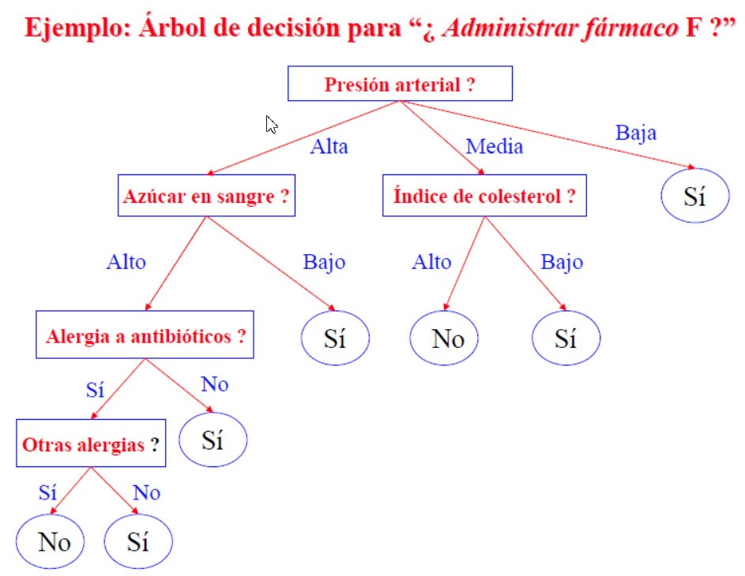
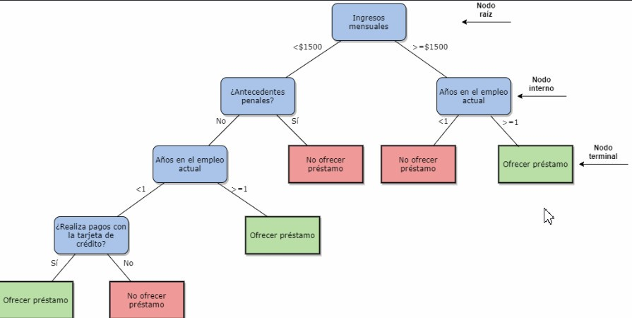

# PSEINT

- PSeInt es un programa gratuito y de código abierto utilizado para enseñar algoritmos y programación a principiantes. El nombre significa "Pseudo Intérprete" y se refiere al hecho de que es capaz de interpretar código escrito en pseudocódigo, que es una forma simplificada de escribir código que no está asociado a un lenguaje de programación específico.
- PSeInt proporciona un entorno de desarrollo integrado (IDE) donde los estudiantes pueden escribir, probar y depurar sus algoritmos. El programa es capaz de analizar el código escrito en pseudocódigo y detectar errores de sintaxis y lógica, lo que permite a los estudiantes aprender de sus errores y mejorar sus habilidades de programación.
- Además de su función como entorno de desarrollo, PSeInt también cuenta con una serie de recursos educativos para ayudar a los estudiantes a comprender mejor los conceptos de programación, como tutoriales y ejemplos de código.
- En resumen, PSeInt es una herramienta muy útil para aprender programación y algoritmos, especialmente para aquellos que recién se inician en el mundo de la informática y necesitan una introducción suave antes de pasar a lenguajes de programación más avanzados.

# SECUENCIAL

- ##### CALCULAR EL AREA DE UN TRIANGULO.

<pre><code>
Algoritmo Calcular_Area_Triangulo
    //DEFINIR DATOS
    Definir b,h,a Como Real
    //ENTRADA
    Escribir Sin Saltar "Ingrese Base? "
    Leer b
    Escribir Sin Saltar "Ingrse Altura? "
    Leer h
    //PROCESO
    a = (b*h)/2
    //SALIDA
    Escribir "Area: ", a
FinAlgoritmo
</pre></code>

- ##### RESOLVER UNA ECUACION LINEAL.

<pre><code>
Algoritmo CalcularEcuacionLineal
	//DEFINIR DATOS
	Definir a,b,x Como Real
	//ENTRADA
	Escribir Sin Saltar"Da un valor para a"
	Leer a
	Escribir Sin Saltar"Da un valor para b"
	Leer b
	//PROCESO 
	x = -b/a
	//SALIDA
	Escribir "El valor de x es: " ,x
FinAlgoritmo
</pre></code>

- ##### CONVERTIR UN NUMERO BINARIO A DECIMAL.

<pre><code>
Algoritmo ConvertirBinarioDecimal
	//Deninir datos
	Definir b0,b1,b2,b3,resultado Como Entero
	//Entrada
	//Al hablar de numero binario hay que tener en cuenta que el primer dígito es el de la derecha del todo
	Escribir "Escribir 0 o 1 para el primer d�gito"
	Leer b0
	Escribir "Escribir 0 o 1 para el segundo d�gito"
	Leer b1
	Escribir "Escribir 0 o 1 para el tercero d�gito"
	Leer b2
	Escribir "Escribir 0 o 1 para el cuarto d�gito"
	Leer b3
	//Proceso 
	resultado = b3*2^3+b2*2^2+b1*2^1+b0*2^0
	//Salida
	Escribir "El binario transformado en decimal es: ",resultado
FinAlgoritmo
</pre></code>

- ##### DAR LA VUELTA A UN NUMERO DE DOS DIGITOS.

<pre><code>
Algoritmo DarVueltaNumeroDosDigitos
	//DEFINIR DATOS
	Definir x,cociente,residuo,resultado Como Entero
	//ENTRADA
	Escribir 'Escribe un valor de dos digitos: '
	Leer x
	//PROCESO 
	cociente <- trunc(x/10)
	residuo <- x%10
	resultado <- (residuo*10)+cociente
	//SALIDA
	Escribir 'El n�mero invertido es: ',resultado
FinAlgoritmo
</pre></code>

- ##### CALCULAR EL IVA.

<pre><code>
Algoritmo Calculo_IVA
	//DEFINIR DATOS
	Definir precio_producto, iva, resultado Como Real
	//ENTRADA
	iva = 1.21
	Escribir Sin Saltar"Ingrese precio producto"
	Leer precio_producto
	//PROCESO
	resultado = precio_producto * iva
	//SALIDA
	Escribir "Precio final: " , resultado
FinAlgoritmo
</pre></code>

- ##### CONVERTIR UNA CANTIDAD DE SEGUNDOS A HORAS, MINUTOS Y SEGUNDOS.

<pre><code>
Algoritmo SegundosAHorasMinutosSegundos
	//DEFINIR DATOS
	Definir cantidad_segundos, horas, minutos, resto1, resto2 Como Entero
	//ENTRADA
	Escribir "Ingresar cantidad en segundos? "
	Leer cantidad_segundos
	//PROCESO
	//1 HORA = 60 minutos = 60 * 60 = 3600 SEGUNDOS
	//1 MINUTOS = 60 SEGUNDOS
	horas = TRUNC(cantidad_segundos / 3600)
	resto1 = cantidad_segundos % 3600
	
	minutos =  TRUNC(resto1 / 60)
	resto2 = resto1 % 60 //SEGUNDOS
	//SALIDA
	Escribir "Horas    : ", horas
	Escribir "Minutos  : ", minutos
	Escribir "Segundos : ", resto2
FinAlgoritmo
</pre></code>

# CONDICIONAL BINARIO (IF...THEN...ELSE)

- ##### DECIR SI UN NÚMERO ES POSITIVO O NEGATIVO

<pre><code>
Algoritmo DecirNumeroPositivoNegativo
	//DEFINR DATOS
	Definir a Como entero
	//ENTRADA
	Escribir "Escribe l�gico para a: "
	Leer a
	//PROCESO - SALIDA
	Si a >= 0
		Escribir "El n�mero: ",a, " es positivo"
	SiNo
		Escribir "El n�mero: ",a, " es negativo"
	FinSi
FinAlgoritmo
</pre></code>

- ##### ORDENAR 3 NUMEROS ENTEROS DE MAYOR A MENOR

<pre><code>
Algoritmo Ordenar_Tres_Numeros_Mayor_A_Menor
   //DEFINR DATOS
   Definir a,b,c,pro Como Entero
   Definir resultado Como Caracter
   //ENTRADA
   Escribir Sin Saltar "Ingrese nota 1? "
   Leer a
   Escribir Sin Saltar "Ingrese nota 2? "
   Leer b
   Escribir Sin Saltar "Ingrese nota 3? "
   Leer c
   //PROCESO
   pro = (a+b+c)/3
	
   Si a>=b Y b>=c 
      resultado = ConvertirATexto(a) + "  " + ConvertirATexto(b) + "  " + ConvertirATexto(c)
   FinSi
   Si a>=c Y c>=b
      resultado = ConvertirATexto(a) + "  " + ConvertirATexto(c) + "  " + ConvertirATexto(b)
   FinSi
   Si b>=a Y a>=c
      resultado = ConvertirATexto(b) + "  " + ConvertirATexto(a) + "  " +ConvertirATexto(c)
   FinSi
   Si b>=c Y c>=a
      resultado = ConvertirATexto(b) + "  " + ConvertirATexto(c) + "  " + ConvertirATexto(a)
   FinSi
   Si c>=a Y a>=b
      resultado = ConvertirATexto(c) + "  " + ConvertirATexto(a) + "  " + ConvertirATexto(b)
   FinSi
   Si c>=b Y b>=a
      resultado = ConvertirATexto(c) + "  " + ConvertirATexto(b) + "  " + ConvertirATexto(a)
   FinSi
   //SALIDA	
   Escribir "Promedio: ", pro
   Escribir "Ordenado Mayor a Menor: ", resultado
FinAlgoritmo
</pre></code>

- ##### EVALUAR UNA NOTA EN INTERVALOS

<pre><code>
Algoritmo EvaluarNotaIntervalos
	//Definir datos
	Definir a Como Real
	//Entrada
	Escribir "Escribe la nota: "
	Leer a
	//Proceso 
	Si a<0 O a>10
		Escribir "Nota no valida"
	FinSi
	Si a>=0 Y a<5
		Escribir "Insuficiente"
	FinSi
	Si a>=5 Y a<6
		Escribir "Suficiente"
	FinSi
	Si a>=6 Y a<7
		Escribir "Bien"
	FinSi
	Si a>=7 Y a<=8
		Escribir "Notable"
	FinSi
	Si a>=9 Y a<=10
		Escribir "Sobresaliente"
	FinSi
FinAlgoritmo
</pre></code>

# COMPUERTAS LOGICAS

- ##### RESOLVER LA COMPUERTA AND.

<pre><code>
Algoritmo Compuerta_AND
	//DEFINIR DATOS
	Definir a,b,and como Logico
	//ENTRADA
	Escribir "Escribe l�gico para a: "
	Leer a
	Escribir "Escribe l�gico para b: "
	Leer b
	//PROCESO - SALIDA
	Si a Y b
		and = Verdadero
		Escribir "Resultado: ",and
	SiNo
		and = Falso
		Escribir "Resultado: ",and
	FinSi
FinAlgoritmo
</pre></code>

- ##### RESOLVER LA COMPUERTA OR.

<pre><code>
Algoritmo Compuerta_OR
	//DEFINIR DATOS
	Definir a,b,or como Logico
	//ENTRADA
	Escribir "Escribe l�gico para a: "
	Leer a
	Escribir "Escribe l�gico para b: "
	Leer b
	//PROCESO - SALIDA
	Si a O b
		or = Verdadero
		Escribir "Resultado: ",or
	SiNo
		or = Falso
		Escribir "Resultado: ",or
	FinSi
FinAlgoritmo
</pre></code>

- ##### RESOLVER LA COMPUERTA NOT.

<pre><code>
Algoritmo Compuerta_NOT
    //DEFINIR DATOS
    Definir a,resultado como Logico
    //ENTRADA
    Escribir "Escribe lógico para a: "
    Leer a
    //PROCESO 
    resultado = NO a
    //SALIDA
    Escribir "El resultado es: ",resultado
FinAlgoritmo
</pre></code>

- ##### RESOLVER LA COMPUERTA NAND.

<pre><code>
Algoritmo Compuerta_NAND
	//DEFINIR DATOS
	Definir a,b,and, resultado como Logico
	//ENTRADA
	Escribir "Escribe l�gico para a: "
	Leer a
	Escribir "Escribe l�gico para b: "
	Leer b
	//PROCESO - SALIDA
	Si a Y b
		and = Verdadero
		resultado = No and
		Escribir "Resultado: ",resultado
	SiNo
		and = Falso
		resultado = No and
		Escribir "Resultado: ",resultado
	FinSi
FinAlgoritmo
</pre></code>

- ##### RESOLVER LA COMPUERTA NOR.

<pre><code>
Algoritmo Compuerta_NOR
	//DEFINIR DATOS
	Definir a,b,or como Lógico
	//ENTRADA
	Escribir "Escribe lógico para a: "
	Leer a
	Escribir "Escribe lógico para b: "
	Leer b
	//PROCESO - SALIDA
	Si a O b
		or = Verdadero
		Escribir "Resultado: ", NO or
	SiNo
		or = Falso
		Escribir "Resultado: ", NO or
	FinSi
FinAlgoritmo
</pre></code>

- ##### RESOLVER LA COMPUERTA XOR.

<pre><code>
Algoritmo Compuerta_XOR
	//DEFINIR DATOS
	Definir a,b,xor Como Logico
	//ENTRADA
	Escribir "Escribe lógico para a: "
	Leer a
	Escribir "Escribe lógico para b: "
	Leer b
	//PROCESO - SALIDA
	Si a = b
		xor= Falso
		Escribir "Resultado: ",xor
	SiNo
		xor = Verdadero
		Escribir "Resultado: ", xor
	Fin Si
FinAlgoritmo
</pre></code>

# PARA (FOR)

- ##### GENERAR UNA SERIE NATURAL DEL 1 AL N, USANDO PARA.

<pre><code>
Algoritmo For_Serie_Natural_1_N
   //DEFINIR DATOS
   Definir i,n Como Entero
   //ENTRADA
   Escribir Sin Saltar "Ingrese n? "
   Leer n
   //PROCESO - SALIDA
   Para i=1 Hasta n Con Paso 1 Hacer
      Escribir i
   FinPara
FinAlgoritmo
</pre></code>

- ##### GENERAR UNA SERIE NATURAL DE N AL 1, USANDO PARA.

<pre><code>
Algoritmo For_Serie_Natural_N_1
    //DEFINIR DATOS
    Definir i,n Como Entero
    //ENTRADA
    Escribir Sin Saltar "Ingrese n? "
    Leer n
    //PROCESO - SALIDA
    Para i<=n Hasta 1 Con Paso -1 Hacer
       Escribir i
    FinPara
FinAlgoritmo
</pre></code>

- ##### RECORRER UNA CADENA

<pre><code>
Algoritmo Recorrer_Cadena
   //DEFINIR DATOS
   Definir tex Como Caracter
   Definir i Como Entero
   //ENTRADA
   Escribir "Ingrese un texto? "
   Leer tex
   //PROCESO - SALIDA
   Para i<-1 Hasta Longitud(tex) Con Paso 1 Hacer
      Escribir Subcadena(tex,i,i)
   Fin Para
FinAlgoritmo
</pre></code>

- ##### RECORRER UNA CADENA EN FORMA INVERTIDA (DESDE EL FINAL AL INICIO)

<pre><code>
Algoritmo Recorrer_Cadena_Invertida
   //DEFINIR DATOS
   Definir tex Como Caracter
   Definir i Como Entero
   //ENTRADA
   Escribir "Ingrese un texto? "
   Leer tex
   //PROCESO - SALIDA
   Para i<-Longitud(tex) Hasta 1 Con Paso -1 Hacer
      Escribir Subcadena(tex,i,i)
   Fin Para
FinAlgoritmo
</pre></code>

# MIENTRAS HACER (WHILE)

- GENERAR UNA SERIE NATURAL DEL 1 AL N, USANDO MIENTRAS.

<pre><code>
Algoritmo While_Serie_Natural_1_N
    //DEFINIR DATOS
    Definir i,n Como Entero
    //ENTRADA
    Escribir "Ingrese n? "
    Leer n
    //PROCESO - SALIDA
    i = 1
    Mientras i<=n Hacer
       Escribir i
       i = i + 1
    FinMientras
FinAlgoritmo
</pre></code>

# REPETIR HASTA QUE (DO...WHILE)

- GENERAR UNA SERIE NATURAL DEL 1 AL N, USANDO REPETIR HASTA QUE.

<pre><code>
Algoritmo DoWhile_Serie_Natural_1_N
   //DEFINIR DATOS
   Definir i,n Como Entero
   //ENTRADA
   Escribir Sin Saltar "Ingrese n? "
   Leer n
   //PROCESO - SALIDA
   i = 1
   Repetir
      Escribir i
      i = i + 1
   Hasta Que i>n
FinAlgoritmo
</pre></code>

# NUMEROS ALEATORIOS

- ##### LANZAR UN DADO N VECES LUEGO CONTABILIZAR CUANTAS VECES SALIO CADA LADO PARA FINALIZAR MUESTRA EL LADO CON MAYOR SALIDAS.

<pre><code>
Algoritmo Mayor_Lado_Lanzamiento_N
	//DEFINIR DATOS
	Definir i,n,x Como Entero
	//ENTRADA
	Escribir "Ingrese número lanzamientos dado? "
	Leer n
	Para i<-1 Hasta n Con Paso 1 Hacer
		x = Aleatorio(1,6)
		Escribir x
		Si x = 1
			c1 = c1 + 1
		FinSi
		Si x = 2
			c2 = c2 + 1
		FinSi
		Si x = 3
			c3 = c3 + 1
		FinSi
		Si x = 4
			c4 = c4 + 1
		FinSi
		Si x = 5
			c5 = c5 + 1
		FinSi
		Si x = 6
			c6 = c6 + 1
		FinSi
	Fin Para
	Escribir "Lado 1: ", c1
	Escribir "Lado 2: ", c2
	Escribir "Lado 3: ", c3
	Escribir "Lado 4: ", c4
	Escribir "Lado 5: ", c5
	Escribir "Lado 6: ", c6
	mayor = c1
	lado = 1
	Si c2 >= mayor
		mayor = c2
		lado = 2
	FinSi
	Si c3 >= mayor
		mayor = c3
		lado = 3
	FinSi
	Si c4 >= mayor
		mayor = c4
		lado = 4
	FinSi
	Si c5 >= mayor 
		mayor = c5
		lado = 5
	FinSi
	Si c6 >= mayor
		mayor = c6
		lado = 6
	FinSi
	
	//LADOS MAYORES
	Si c1 = mayor
		Escribir "Lado Mayor: ", 1
	FinSi
	Si c2 = mayor
		Escribir "Lado Mayor: ", 2
	FinSi
	Si c3 = mayor
		Escribir "Lado Mayor: ", 3
	FinSi
	Si c4 = mayor
		Escribir "Lado Mayor: ", 4
	FinSi
	Si c5 = mayor
		Escribir "Lado Mayor: ", 5
	FinSi
	Si c6 = mayor
		Escribir "Lado Mayor: ", 6
	FinSi	
FinAlgoritmo
</pre></code>

- ##### HACER UN PROGRAMA QUE GENERE 10 NUMEROS ALEATORIOS ENTRE 36000 Y 10000 QUE SERAN CANTIDADES EN SEGUNDOS Y EL PROGRAMA PROCEDERA A DETERMINAR LA CANTIDAD DE HORAS-MIMUNTOS-SEGUNDOS Y SI ES PAR O IMPAR.

<pre><code>
Algoritmo SegundosAHorasMinutosParImparAleatorio
	//DEFINIR DATOS
	Definir cantidad_segundos, horas, minutos, resto1, resto2 Como Entero
	//PROCESO
	Para i<-1 Hasta 10 Con Paso 1 Hacer
		cantidad_segundos = Aleatorio(3600,10000)
		
		Si cantidad_segundos % 2 = 0
			resultado = "PAR"
		SiNo
			resultado = "IMPAR"
		FinSi
		
		horas = TRUNC(cantidad_segundos / 3600)
		resto1 = cantidad_segundos % 3600
		
		minutos =  TRUNC(resto1 / 60)
		resto2 = resto1 % 60 //SEGUNDOS
		//SALIDA
		Escribir i,")",cantidad_segundos, "  ", "Horas : ", horas, "  ", "Minutos : ", minutos, "  ", "Segundos : ", resto2, "  ", resultado
	Fin Para
FinAlgoritmo
</pre></code>
		
# ARBOL DE DECISION

- ##### IMPLEMENTAR EL PROGRAMA PARA EL ARBOL DE DECISION DE APLICAR O NO UN FARMACO

<pre><code>
Algoritmo ArbolDecisionFarmaco
	Definir p1,p2,p3 Como Caracter
	Definir salir Como Logico
	
	salir=falso
	Repetir
		salir=falso
		Escribir "P1 - Presi�n Arterial (A=Alta,M=Media,B=Baja)?"
		Leer p1
		Si p1 = "A" Entonces
			Escribir "P3 - Azucar en sangre(A=Alto,B=Bajo)? "
			Leer p3
			Si p3="A" O p3="B" Entonces
				Si p3="B" Entonces 
					Escribir "Si puede tomar farmaco F"
				SiNo
					Escribir "P4 - Alergia Antibioticos(S=Si,N=No)? "
					Leer p4
					Si p4 = "S" O p4 ="N"
						Si p4 = "S" Entonces
							Escribir "P5 - Otras Alergias(S=Si,N=No)? "
							Leer p5
							Si p5 = "S" O p5 = "N" Entonces
								Si p5 = "S" Entonces
									Escribir "No puede tomar farmaco F"
								SiNo
									Escribir "Si puede tomar farmaco F"
								FinSi
							SiNo
								Escribir "ENTRADA INCORRECTA"
								salir=Verdadero
							FinSi
						SiNo
							Escribir "Si se puede tomar farmaco F"
						FinSi
					SiNo
						Escribir "ENTRADA INCORRECTA"
						salir=Verdadero
					FinSi
				FinSi
			SiNo
				Escribir "ENTRADA INCORRECTA"
				salir=Verdadero
			FinSi
		FinSi
		
		Si p1 = "M" Entonces
			Escribir "P2 - Indice de Colesterol(A=Alto,B=Bajo)? "
			Leer p2
			Si p2 = "A" O p2 = "B" Entonces
				Si p2 = "B" Entonces
					Escribir "Si puede tomar el farmaco F"
				SiNo
					Escribir "No puede tomar el farmaco F"
				FinSi
			SiNo
				Escribir "ENTRADA INCORRECTA"
				salir=Verdadero
			FinSi
		FinSi
		
		Si p1 = "B" Entonces
			Escribir "Si puede tomar farmaco F"
		FinSi
		
		Si p1 <> "A" Y p1 <> "B" Y p1 <> "M" Entonces
			Escribir "ENTRADA INCORRECTA"
			salir=Verdadero
		FinSi
	Hasta Que salir=falso
FinAlgoritmo
</pre></code>

- ##### IMPLEMENTAR EL PROGRAMA PARA EL ARBOL DE DECISION IDENTIFICAR O NO UN GATO

<pre><code>
Algoritmo ArbolDecisionGato
	//DEFINIR DATOS
	Definir p1,p2,p3 Como Logico
	//ETRADA - PROCESO - SALIDA
	Escribir "P1 - �Tiene 4 patas?"
	Leer p1
	Si p1 = Verdadero Entonces
		Escribir "P2 - �Tiene Orejas Redondas?"
		Leer p2
		Si p2 = Verdadero Entonces
			Escribir "No es un Gato"
		SiNo
			Escribir "P3 - �Tiene Bigotes?"
			Leer p3
			Si p3 = Verdadero Entonces
				Escribir "Es un Gato"
			SiNo
				Escribir "No es un Gato"
			FinSi
		FinSi
	SiNo
		Escribir "No es un gato"
	FinSi
FinAlgoritmo
</pre></code>

- ##### IMPLEMENTAR EL PROGRAMA PARA EL ARBOL DE DECISION OFRECER O NO UN PRESTAMO

<pre><code>
Algoritmo ArbolDecisionPrestamo
	Definir im Como Entero
	Definir a Como Real
	Definir ap,tc Como Logico
	Escribir Sin Saltar "Ingresos Mensuales? "
	Leer im
	Si im < 1500 Entonces
		Escribir Sin Saltar"Antedecentes Penales? "
		Leer ap
		Si ap = Verdadero
			Escribir "No Ofrecer Prestamo X"
		SiNo
			Escribir Sin Saltar "Años en el Empleo Actual? "
			Leer a
			Si a >= 1
				Escribir "Ofrecer Préstamo Y"
			SiNo
				Escribir Sin Saltar "Realiza pagos con la tarjeta de crédito? "
				Leer tc
				Si tc = Verdadero
					Escribir "Ofrecer Préstamo Y"
				SiNo
					Escribir "No Ofrecer Préstamo X"
				FinSi
			FinSi
		FinSi
	SiNo
		Escribir Sin Saltar"Años en el empleo actual? "
		Leer a
		Si a >= 1
			Escribir "Ofrecer Préstamo X"
		SiNo
			Escribir "No Ofrecer Préstamo Y"
		FinSi
	FinSi
FinAlgoritmo
</pre></code>

# ARRAY UNIDIMENSIONAL (VECTOR)

- ##### HACER UN PROGRAMA QUE PERMITA CREAR UN VECTOR, LLENARLO Y LUEGO RECORRERLO

<pre><code>
Algoritmo Vector1
    Definir longitudd Como Entero
    Definir numeross Como Entero
    Escribir Sin Saltar "Ingrese longitud vector? "
    Leer longitudd
    //CREAR VECTOR
    Dimension numeross[longitudd]
    //LLENAR VECTOR
    Para i=1 Hasta longitudd Con Paso 1 Hacer
       Escribir Sin Saltar "Ingres un número? "
       Leer numeross(i)
    FinPara
    //RECORRER VECTOR
    Para i=1 Hasta longitudd Con Paso 1 Hacer
       Escribir numeross(i)
    FinPara
FinAlgoritmo
</code></pre>

# ARRAY BIDIMENSIONAL (MATRIZ)

- ##### HACER UN PROGRAMA QUE PERMITA CREAR UNA MATRIZ 3X3, LLENARLO Y LUEGO RECORRERLO

<pre><code>
Algoritmo CrearLlenarRecorrerMatriz
    //DEFINIR MATRIZ
    Definir matriz Como Entero
    nf <- 3
    nc <- 3
    Dimension matriz(nf,nc)
    //LLENAR MATRIZ NFXNC
    Para f <- 1 Hasta nf
       Para c <- 1 Hasta nc
           Escribir Sin Saltar "Ingresar n�mero? "; Leer matriz(f,c)
       FinPara
    FinPara
    //RECORRER MATRIZ NFXNC
    Para f <- 1 Hasta nf
       Para c <- 1 Hasta nc
           Escribir Sin Saltar matriz(f,c) " "
       FinPara
       Escribir ""
    FinPara
FinAlgoritmo
</code></pre>

# ANEXO 1: VIDEO YOUTUBE

  
  

